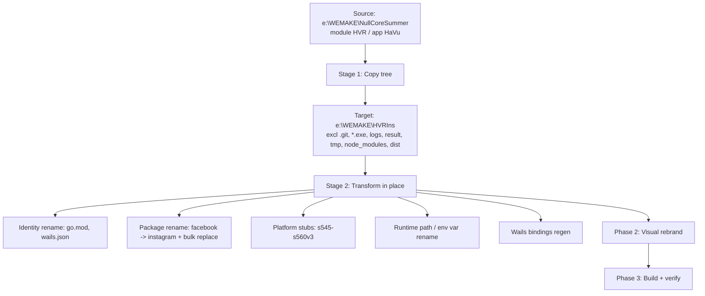

# Design Document

## Overview

This design describes how to clone the existing Wails desktop application currently located at
`e:\WEMAKE\NullCoreSummer` (the source project, referred to in the requirements as **HVRFb** /
**HVR**) into a new, Instagram-branded project named **HVRIns** rooted at `e:\WEMAKE\HVRIns`
(the current spec workspace). The work follows `NVRINS_BUILD_GUIDE.md`, substituting the guide's
example name `NVRIns` with `HVRIns` throughout.

The migration is intentionally a **build-able skeleton only**. The Go module compiles, the Wails app
launches, and the UI is fully rebranded to Instagram — but the real Instagram protocol flows
(endpoints, headers, cookie names, token parsers) are **not** ported. Facebook-specific platform
variants are stubbed to return an "unsupported platform" result, and Facebook-specific tokens and
user-agent pools are left in place as documented `TODO` placeholders for future Instagram work.

The effort spans three phases mapped to the 16 requirements:

| Phase | Theme | Requirements |
|-------|-------|--------------|
| Phase 1 | Code migration (copy + transform) | 1, 2, 3, 4, 5 |
| Phase 2 | Visual rebrand (Instagram) | 6, 7, 8, 9, 10, 11, 12 |
| Phase 3 | Build & verify | 13, 14, 15, 16 |

### Discrepancies from the Build Guide

The Build Guide was written against an earlier clone and uses placeholder names that **do not match
the real source project**. The design corrects them as follows, and these corrections are
authoritative wherever they conflict with the guide:

1. **Real Go module name is `HVR`, not `HVRFb`.** `go.mod` in the source declares `module HVR`.
   Therefore Go import paths in the source look like `"HVR/internal/facebook/..."` and `"HVR/..."`,
   **not** `"HVRFb/..."`. Every transformation rule that the guide writes against `HVRFb/` MUST be
   read and implemented against `HVR/`:
   - `"HVR/internal/facebook"` → `"HVRIns/internal/instagram"`
   - `"HVR/"` (any other) → `"HVRIns/"`
   - `module HVR` → `module HVRIns`
   Requirements that mention "the prior module name `HVRFb`" (e.g. 1.6, 2.3, 2.4) are satisfied by
   ensuring zero occurrences of **`HVR/` import prefixes and `module HVR`** remain — the literal
   `HVRFb` never appears in the source, so the intent is "no source-module import prefix remains".

2. **Real Wails app name is `HaVu`, not `HVRFb`.** `wails.json` declares `"name": "HaVu"` and
   `"outputfilename": "HaVu"`. These become `"HVRIns"` / `"HVRIns"`.

3. **No literal `HVRFb` runtime path segment exists.** The source does not build paths like
   `filepath.Join(appData, "HVRFb", "logs")`. Instead all runtime paths are anchored on
   `appDataDir()` (in `datadir.go`), which resolves to `bin/dev/` in dev builds or the executable's
   directory in production, overridable via the **`HVR_DATA_DIR`** environment variable. The only
   branding-bearing identifier in the runtime-path layer is the env var name `HVR_DATA_DIR`.
   Requirement 4's intent — "no `HVRFb` runtime segment remains; the app uses its own dirs" — is
   therefore satisfied by renaming the `HVR_DATA_DIR` env var to `HVRINS_DATA_DIR` and confirming
   the relative `logs/`, `result/`, and `Config/` directories continue to resolve under the
   HVRIns data dir. See [Runtime Path Migration](#runtime-path-migration).

These discrepancies are also surfaced in the verification strategy so the migration is checked
against reality rather than the guide's placeholder names.

## Architecture

### Migration approach: copy then transform in place

The migration is a **two-stage pipeline**: a faithful tree copy followed by a set of deterministic,
idempotent in-place transformations applied at the target root.



**Why copy + transform rather than git clone or fresh scaffold:** the source is a large,
working Wails project with hundreds of platform subpackages. A verbatim copy preserves every
working file; transformation then touches only the identity, package boundary, stub points,
runtime-path identifier, and frontend branding. This keeps the diff auditable and the risk of
silent behavioral drift low.

**Preservation during copy.** The target root already contains assets that must survive the copy:
- `e:\WEMAKE\HVRIns\NVRINS_BUILD_GUIDE.md`
- `e:\WEMAKE\HVRIns\.kiro\` (the spec directory, including this design)

The copy MUST merge the source tree into the target **without** overwriting or deleting these.

### Copy exclusions

The following are excluded from Stage 1 because they are derived artifacts, VCS metadata, or
machine-local state that must be regenerated rather than carried over:

| Excluded | Reason |
|----------|--------|
| `.git/` | Source VCS history; target has its own repository |
| `*.exe`, `build/bin/` | Build artifacts; regenerated in Phase 3 |
| `logs/`, `result/` | Runtime output dirs |
| `bin/dev/` | Dev-mode data dir (regenerated at first `wails dev`) |
| `frontend/node_modules/` | Reinstalled via `npm install` |
| `frontend/dist/` | Regenerated via `npm run build` |
| `tmp/`, `*.log` | Scratch / log files |
| `.kiro/` (source, if any) | Target spec dir must be preserved as-is |

### Transformation engine

The code transformations (Phase 1 steps 2.2–2.6 and 12.1–12.4) are implemented as **pure text
functions** applied per file. This is the architectural seam that makes the migration testable:
each rule is a deterministic string-to-string transformation whose correctness can be verified
by property-based tests over arbitrarily generated source content, independent of the actual
repository. The transformation rules are listed in
[Transformation Rules](#transformation-rules-data-models).

Transformations are designed to be **idempotent**: re-running the pipeline over an
already-migrated tree produces no further changes. This allows safe re-execution after a partial
failure.

### Scope boundary: stubs, not protocol ports

The `internal/facebook` package is renamed to `internal/instagram` and its import graph is
rewired, but the Instagram protocol is **not** implemented. The factory's Facebook-specific
platform variants (`s545`–`s560v3`) are replaced with stub handlers that return an
"unsupported platform" status. Facebook session tokens (`fb_dtsg`, `jazoest`, `lsd`, `datr`,
`c_user`) and Facebook user-agent pool entries (`FBAN/FB4A`, `FBPN/com.facebook.katana`) are kept
verbatim with inline `TODO` annotations marking the pending Instagram equivalents
(`csrftoken`, `ds_user_id`, `sessionid`, `mid`, `ig_did`, `rur`; Instagram UA strings).

## Components and Interfaces

### Phase 1 — Code migration components

#### 1. Tree copier
- **Input:** source root `e:\WEMAKE\NullCoreSummer`, target root `e:\WEMAKE\HVRIns`, exclusion list.
- **Behavior:** recursively copies files not matching the exclusion list, preserving the
  pre-existing target files (`NVRINS_BUILD_GUIDE.md`, `.kiro/`).
- **Output:** populated target tree.

#### 2. Identity renamer (Req 1)
- Edits `go.mod`: `module HVR` → `module HVRIns`.
- Edits `wails.json`: `"name": "HaVu"` → `"HVRIns"`, `"outputfilename": "HaVu"` → `"HVRIns"`.
- **Precondition guard:** if `go.mod` or `wails.json` is missing or unwritable, abort the rename,
  leave all target files unchanged, and return an error naming the affected file (Req 1.5).
- **Postcondition:** zero source-module identifiers (`module HVR`, `HVR/` import prefixes) remain
  in `go.mod`/`wails.json` (Req 1.6).

#### 3. Package renamer + bulk replacer (Req 2)
- **Directory move:** `internal/facebook` → `internal/instagram`, preserving all files and
  subdirectories byte-for-byte (Req 2.1).
- **Precondition guards:**
  - If `internal/facebook` does not exist, abort and report the missing source dir (Req 2.7).
  - If `internal/instagram` already exists, abort and report the destination conflict (Req 2.8).
- **Text transforms** applied to every `*.go` file (see [Transformation Rules](#transformation-rules-data-models)):
  - package declaration, import prefixes, symbol qualifier, with `facebook.com` preserved.
- The directory move executes **before** the text transforms so import paths and package
  declarations resolve against the new layout.

#### 4. Platform stubber (Req 3)
- **Target:** the factory registration for platform variants `s545` through `s560v3` plus the
  handler structures `register/web`, `verify/web`, `register/android`, `verify/android`.
- **Interface preserved:** each stubbed platform keeps its named, exported handler type and method
  set so the factory and callers still compile (Req 3.1). The Facebook protocol bodies are removed
  and replaced with a stub body that returns a result whose status is `unsupported platform`
  (Req 3.2) and that mutates neither its arguments nor application state (Req 3.3).
- **Token / UA annotation:** the tokens `fb_dtsg`, `jazoest`, `lsd`, `datr`, `c_user` and the UA
  entries `FBAN/FB4A`, `FBPN/com.facebook.katana` each receive an inline `// TODO(instagram): ...`
  comment while keeping their existing value unchanged (Req 3.4, 3.5).

Stub body shape (illustrative):

```go
// platformResult is the package's existing result type.
func (h *WebHandler) Run(ctx context.Context, in Input) (Result, error) {
    // TODO(instagram): Facebook platform s545–s560v3 has no Instagram equivalent yet.
    return Result{Status: StatusUnsupportedPlatform}, nil
}
```

A single `StatusUnsupportedPlatform` constant is added to the existing status enumeration
(`internal/instagram/status.go`) so all stubs share one status value.

#### 5. Runtime path migrator (Req 4)
- **Reality (see Discrepancies):** runtime paths derive from `appDataDir()` and the `HVR_DATA_DIR`
  env var, not a literal `HVRFb` segment.
- **Behavior:** rename the env var identifier `HVR_DATA_DIR` → `HVRINS_DATA_DIR` in `datadir.go`
  (and any references), leaving the data-dir resolution logic and the relative `logs/`, `result/`,
  `Config/` join segments intact (Req 4.1–4.4). Because the literal `HVRFb` is absent, the
  "zero `HVRFb` segments remain" postcondition holds trivially and is asserted by a grep check.
- **Postcondition:** the migrated app reads/writes `logs/`, `result/`, `Config/` under its own
  data dir, with no reference to the source env var name (Req 4.5).

#### 6. Wails bindings regenerator (Req 5)
- Runs `wails generate module` (or first `wails dev`) after the Go type/package changes.
- **Postcondition:** generated bindings (`frontend/wailsjs/`) reference `instagram` symbols and
  contain zero `facebook` symbol references (Req 5.2, 5.3).
- **Failure handling:** if regeneration fails, report the binding-generation error and leave the
  previously generated bindings unchanged (Req 5.4).

### Phase 2 — Visual rebrand components

#### 7. Icon generator (Req 6)
- A Python (Pillow) script produces `build/appicon.png` (1024×1024, rounded corners radius 160) with
  a 135° diagonal gradient through `#405DE6 → #833AB4 → #E1306C → #FD1D1D → #FCAF45`, the centered
  white app name `HVRIns`, and the subtitle `Ha Vu VIP PRO` at 60% opacity below it.
- Derives `build/windows/icon.ico` containing exactly sizes 16/32/48/64/128/256.
- On failure, report the failing asset and leave any existing icon untouched (Req 6.6).

#### 8. Frontend rebrand editor
The following frontend files are edited. Each row lists the requirement(s) and the concrete change.

| File | Change | Req |
|------|--------|-----|
| `frontend/src/styles/tokens.css` | `--brand-primary:#E1306C`; `--accent:#E1306C`; `--brand-gradient:linear-gradient(135deg,#833AB4,#E1306C,#FD1D1D)`; `--sidebar-bg:#0e0c18` (plus hover/bg/border aliases) | 7.1–7.4 |
| `frontend/src/styles/light.css` | light-theme `--brand-primary:#E1306C`, `--accent:#E1306C` (plus sidebar/grid/input-focus accents) | 7.5, 7.6 |
| `frontend/src/components/shell/AppSidebar.vue` | background `var(--sidebar-bg)`; right border 3px solid transparent with vertical `border-image` gradient through the 5 palette stops | 8.1–8.3 |
| `frontend/src/components/shell/AppTitleBar.vue` | replace logo SVG with Instagram camera (rounded-square outline + centered circle + upper dot); gradient stroke `linear-gradient(135deg,#833AB4,#E1306C,#FD1D1D)` | 9.1–9.3 |
| `frontend/src/modules/accounts/components/AccountsToolbar.vue` | Run btn `linear-gradient(135deg,#833AB4,#E1306C,#FD1D1D)`; Stop btn `linear-gradient(135deg,#E1306C,#FD1D1D)`; Stopping btn `linear-gradient(135deg,#405DE6,#833AB4)` | 10.1–10.3 |
| `frontend/src/components/ui/BaseButton.vue` | primary variant background `var(--brand-gradient)` with `#E1306C` solid fallback | 10.4, 10.7 |
| `frontend/src/pages/AccountsPage.vue` | `.accounts-page__cta` background `var(--brand-gradient)`; wrap stats bar in `<Teleport to="#status-bar-page-slot">` | 10.5, 11.6 |
| `frontend/src/components/shell/AppStatusBar.vue` | remove `stats` prop; add `#status-bar-page-slot`; show CPU% + RAM%; two icon-only buttons with `data-tip` CSS tooltips | 11.1–11.5, 11.7, 11.8 |
| `frontend/src/pages/InteractionSetupPage.vue` | replace `#4fc3f7`/`#3b82f6`/`rgba(79,195,247,A)` per color rules | 12.1–12.4 |
| `frontend/src/pages/GeneralSettingsPage.vue` | same color replacement rules | 12.1–12.4 |
| `frontend/src/modules/auth-source/components/AuthSourcePanel.vue` | same color replacement rules | 12.1–12.4 |

#### 9. Status bar / Teleport contract (Req 11)
- `AppStatusBar.vue` renders a fixed layout: a `#status-bar-page-slot` container, the CPU% and RAM%
  resource values, and exactly two icon-only utility buttons (each with a non-empty `data-tip`
  driving a pure-CSS `::after` tooltip).
- Active pages contribute page-specific content by teleporting into `#status-bar-page-slot`. When a
  page provides no slot content, the footer shows only CPU%, RAM%, and the two buttons (Req 11.8).
- The `stats` prop is removed; page stats now flow exclusively through the Teleport slot.

### Phase 3 — Build & verify components

- **Frontend build (Req 13):** `npm install` + `npm run build` in `frontend/`; success = exit 0 and
  emitted artifacts.
- **Backend compile (Req 14):** `go build ./...` at the project root; success = exit 0 across all
  packages.
- **Wails build (Req 15):** `wails build` produces `build/bin/HVRIns.exe`; launching it shows the
  main window with no runtime error dialog.
- **Visual verification (Req 16):** `wails dev` and manual inspection of icon, title-bar logo,
  sidebar, footer Teleport behavior, gradients, and accent colors.

## Data Models

### Transformation Rules (data models)

The bulk-replace transforms are the core data model of Phase 1. Each rule is a pure function
`transform: (fileText) -> fileText`. Rules apply to `*.go` files (Go rules) or the three listed
`.vue` files (color rules). Order matters: the more specific import rule runs before the general one.

#### Go source rules (Req 2) — corrected to module `HVR`

| # | Match (regex) | Replacement | Notes | Req |
|---|---------------|-------------|-------|-----|
| G1 | `"HVR/internal/facebook` | `"HVRIns/internal/instagram` | run before G2 | 2.3 |
| G2 | `"HVR/` | `"HVRIns/` | any remaining import prefix | 2.4 |
| G3 | `\bpackage facebook\b` | `package instagram` | package declaration | 2.2 |
| G4 | `\bfacebook\.([A-Z])` | `instagram.$1` | symbol qualifier only | 2.5 |
| INV | `facebook.com` (in string literals) | *(unchanged)* | preserved by G4's uppercase guard | 2.6 |

The critical invariant is that **G4 only matches `facebook.` followed by an uppercase ASCII letter**,
so URL literals such as `https://www.facebook.com/...` (lowercase `c`) are never rewritten.

#### Vue color rules (Req 12)

| # | Match (case-insensitive) | Replacement | Guard | Req |
|---|--------------------------|-------------|-------|-----|
| C1 | `#4fc3f7` | `var(--accent)` | skip if already inside `var(--accent, ...)` fallback | 12.1 |
| C2 | `#3b82f6` | `var(--accent)` | skip if already inside `var(--accent-hover, ...)` fallback | 12.2 |
| C3 | `rgba(79, 195, 247, A)` (any internal whitespace) | `rgba(225, 48, 108, A)` | preserve alpha `A` verbatim | 12.3 |

Post-condition C4: after C1–C3, no unguarded `#4fc3f7`, `#3b82f6`, or `rgba(79,195,247,...)`
remains in the three files (Req 12.4).

### Instagram palette / token model (Req 7, Phase 2)

| Token | Value |
|-------|-------|
| `--brand-primary` | `#E1306C` |
| `--accent` | `#E1306C` |
| `--brand-gradient` | `linear-gradient(135deg, #833AB4, #E1306C, #FD1D1D)` |
| `--sidebar-bg` | `#0e0c18` |
| Palette stops | `#405DE6`, `#833AB4`, `#E1306C`, `#FD1D1D`, `#FCAF45` |

### Stub result model (Req 3)

```
Result {
    Status: StatusUnsupportedPlatform   // "unsupported platform"
    // all other fields zero-valued; inputs unmodified
}
```

### Project identity model (Req 1)

| Artifact | Source value | Target value |
|----------|--------------|--------------|
| `go.mod` module | `HVR` | `HVRIns` |
| `wails.json` name | `HaVu` | `HVRIns` |
| `wails.json` outputfilename | `HaVu` | `HVRIns` |
| Output binary | `HaVu.exe` | `HVRIns.exe` |

## Correctness Properties

*A property is a characteristic or behavior that should hold true across all valid executions of a
system — essentially, a formal statement about what the system should do. Properties serve as the
bridge between human-readable specifications and machine-verifiable correctness guarantees.*

These properties apply to this feature only where there is genuine input-varying logic:
the **deterministic text-transformation engine** (the Go bulk-replace rules and the Vue color
rules) and the **stub dispatch** behavior. These are pure functions over arbitrary source content
or platform identifiers, so a single property exercised over 100+ generated inputs finds edge cases
(comments, embedded URLs, mixed import blocks, odd whitespace, varied alpha values) that a handful
of examples would miss. The remaining criteria (identity edits, filesystem moves, asset generation,
CSS token values, UI rendering, build outcomes, visual checks) are not input-varying and are
covered by example, snapshot, integration, smoke, and manual tests in the Testing Strategy.

All properties below are written against the corrected source identifiers (module `HVR`, not the
guide's placeholder `HVRFb`).

### Property 1: Go transform rewrites package/symbol while preserving `facebook.com`

*For any* Go source text, after applying the full Go transformation (rules G1–G4), every standalone
`package facebook` declaration is rewritten to `package instagram`, every `facebook.` qualifier
immediately followed by an uppercase ASCII letter is rewritten to `instagram.`, and every literal
substring `facebook.com` present before the transform is preserved byte-for-byte in the output.

**Validates: Requirements 2.2, 2.5, 2.6**

### Property 2: Import-prefix rewrite respects facebook-subpath precedence

*For any* Go source text containing import paths, after the transformation every import beginning
`"HVR/internal/facebook` becomes `"HVRIns/internal/instagram`, every other import beginning `"HVR/`
becomes `"HVRIns/`, and no import retains a `"HVR/` prefix; the more specific facebook-subpath rule
takes precedence over the general rule.

**Validates: Requirements 2.3, 2.4**

### Property 3: Stubbed platforms return unsupported status without side effects

*For any* platform identifier in the range `s545` through `s560v3` and any valid input arguments,
invoking the stubbed handler returns a result whose status is `unsupported platform`, returns no
error, and leaves the input arguments and application state unchanged (equal to their pre-invocation
values).

**Validates: Requirements 3.2, 3.3**

### Property 4: Hex color replacement is guarded and complete

*For any* `.vue` source text, after applying the hex color rules, every occurrence of `#4fc3f7` or
`#3b82f6` (case-insensitive) that is not already inside an existing `var(--accent, ...)` /
`var(--accent-hover, ...)` fallback expression is replaced with `var(--accent)`, occurrences already
inside such a fallback are left unchanged, and no unguarded occurrence of either literal remains in
the output.

**Validates: Requirements 12.1, 12.2, 12.4**

### Property 5: rgba color replacement preserves alpha

*For any* `.vue` source text containing `rgba(79, 195, 247, A)` color expressions (with any internal
whitespace and any alpha value `A`), after applying the rgba rule the red-green-blue components
`79, 195, 247` are replaced with `225, 48, 108`, the original alpha value `A` is preserved
unchanged, and no `rgba(79, 195, 247, ...)` expression remains in the output.

**Validates: Requirements 12.3, 12.4**

## Error Handling

The migration pipeline favors **fail-fast with no partial mutation** at each guarded step, so a
failed run can be diagnosed and safely re-run (transforms are idempotent).

| Failure | Detection | Response | Req |
|---------|-----------|----------|-----|
| `go.mod`/`wails.json` missing or unwritable | stat/open before write | Abort identity rename, leave all target files unchanged, return error naming the file | 1.5 |
| `internal/facebook` source dir absent | stat before move | Abort package rename, leave files unchanged, error names missing source | 2.7 |
| `internal/instagram` dest dir already exists | stat before move | Abort package rename, leave files unchanged, error names destination conflict | 2.8 |
| Stubbed platform invoked | runtime dispatch | Return `unsupported platform` status, no error, no state change | 3.2, 3.3 |
| Wails binding regeneration fails | CLI exit code | Report binding-generation error, retain previous bindings unchanged | 5.4 |
| Icon asset generation fails | script exit/exception | Report failing asset, leave any existing icon file unchanged | 6.6 |
| `--brand-gradient` unresolved at render | CSS `var()` fallback | Apply solid `#E1306C` background so the CTA stays visible | 10.7 |
| A listed `.vue` file unreadable/unwritable | open before transform | Abort replacements for that file, leave it unchanged, error names the file | 12.5 |
| Frontend build compile error | `npm run build` exit code | Non-zero exit, identify failing source file, no dist artifacts produced | 13.3 |
| Backend compile error | `go build ./...` exit code | Non-zero exit, identify failing package/file, leave source unmodified | 14.2 |
| `wails build` failure | CLI exit code | Report build failure, do not report success for absent/incomplete `HVRIns.exe` | 15.2 |

A guarded step that aborts MUST NOT leave the tree half-transformed for that step; because each
transform is idempotent and order-independent across files, re-running the pipeline after fixing the
cause converges to the fully migrated state.

## Testing Strategy

A dual approach is used. **Property tests** cover the input-varying transformation and stub logic
(Properties 1–5). **Example, snapshot, integration, smoke, and manual tests** cover the
deterministic edits, asset generation, UI rendering, and build outcomes.

### Property-based tests

- **Library:** Go's `testing/quick` or `pgregory.net/rapid` for the Go transform rules (P1–P3);
  a JS/TS PBT library (`fast-check`) for the Vue color rules (P4–P5). Implement each property with a
  **single** property-based test; do not hand-roll a PBT framework.
- **Iterations:** minimum **100** generated inputs per property test.
- **Tagging:** each property test carries a comment in the form
  `Feature: hvrins-instagram-clone, Property {n}: {property text}`.
- **Generators:**
  - P1/P2: generate Go source fragments mixing `package` declarations, `HVR/` and
    `HVR/internal/facebook/...` import paths, `facebook.<Upper>` / `facebook.<lower>` qualifiers, and
    embedded `https://...facebook.com/...` string literals, plus comments and arbitrary identifiers.
  - P3: generate platform identifiers across `s545..s560v3` and arbitrary input argument structs;
    snapshot the pre-state for the no-side-effect assertion.
  - P4: generate `.vue`/CSS text with `#4fc3f7`/`#3b82f6` in both guarded (`var(--accent, ...)`)
    and unguarded positions, varied case.
  - P5: generate `rgba(79, 195, 247, A)` with random alpha `A` and random internal whitespace.

### Example & edge-case unit tests

- Identity edits (1.1–1.4, 1.6), token annotations (3.4, 3.5), CSS token values (7.1–7.6), and
  binding post-conditions (5.3) — assert exact resulting values / grep for absence of stale names.
- Filesystem move preserves the file tree (2.1).
- Error/abort paths: 1.5, 2.7, 2.8, 5.4, 6.6, 10.7, 12.5, 13.3, 14.2, 15.2 — drive the precondition
  and assert no-mutation + correct error identification.
- WCAG contrast for each gradient button's foreground vs lightest stop ≥ 4.5:1 (10.6).

### Snapshot / component tests (frontend)

- `AppSidebar.vue`, `AppTitleBar.vue`, `AccountsToolbar.vue`, `BaseButton.vue`, `AppStatusBar.vue`,
  `AccountsPage.vue` — snapshot the rendered markup/CSS for sidebar border-image, camera SVG,
  button gradients, the two `data-tip` icon buttons, and the `#status-bar-page-slot` composition
  (8.x, 9.x, 10.1–10.5, 11.x).
- Teleport behavior: mount with and without page slot content; assert footer shows page stats vs
  only CPU/RAM + two buttons (11.7, 11.8).

### Integration & smoke tests

- Runtime path behavior with `HVRINS_DATA_DIR` set — assert `logs/`, `result/`, `Config/` resolve
  under it and no source env var name is referenced (4.5).
- Wails binding regeneration references `instagram` symbols (5.2).
- Asset checks: `appicon.png` dimensions/corners/gradient samples and `icon.ico` exact size set
  (6.1–6.5).
- Build smoke: `npm run build`, `go build ./...`, `wails build` exit 0 and produce
  `build/bin/HVRIns.exe`; launching it shows the main window (13.1–13.2, 14.1, 15.1, 15.3).

### Manual visual verification (Req 16)

Run `wails dev` and confirm: Instagram gradient icon and title-bar camera logo; sidebar with
`#0e0c18` background and vertical gradient right border; single-line footer; gradient action
buttons; accent-pink highlights with no leftover blue/cyan literals; Accounts stats appear in the
footer slot and disappear (leaving CPU/RAM + two buttons) when navigating away.
